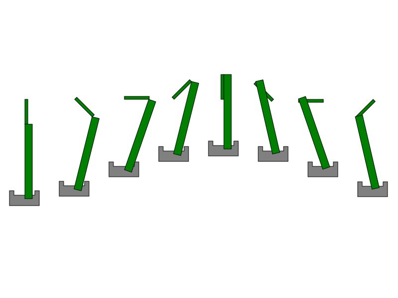

# Meccanismo di spinta

Il programma ha lo scopo di creare immagini di un meccanismo di spinta.



## Getting Started

Per poter eseguire questo programma basta clonare questa repository all'interno della propria macchiana.

* Il branch "*main*" contiene codice funzinante che puo' essere eseguito.
* Il branch "*dev*" contiene il branch di sviluppo, al suo interno potrebbero esserci bug o codice non acnora funzionante
* Altri branch sono branch creati per svuluppare funzioni specifiche.

### Prerequisites

Per poter eseguire il programma e' necessario che sia installata l'estensione cmake (la versione minima richiesta e': VERSION 3.10)

# Guida al programma

Il main e' stato strutturato con uno switch che permette all'utente di svolgere le seguenti azioni:

* creare un nuovo meccanismo e decidere quanti se ne vogliono creare

* salvare su file un meccanismo presente in memori

* leggere un file svg ed estropolare i dati dei device presenti al suo interno

* modificare l'angolo della manovella di un meccanismo a scelta

* uscire dal programma.

### Limitazioni

Non possono essere creati piu' di 8 meccanismi in quanto si uscirebbe dall'immagine.

# Librerie 

Sono state create 3 librerie per eseguire le varie parti del programma:

* [`pistone.h`](include/pistone.h)
* [`sc_scara.h`](https://github.com/FedericoCorso/homework1/blob/master/include/fc_scara.h )(libreria sviluppata da @FedericoCorse per i dettagli si fa riferimento a alla sua repository)
* [`meccanismo_scara.h`](include/meccanismo_scara.h)
* [`svg.h`](include/svg.h)

## Pistone

Parte del meccanismo che scorre in orizzontale. E' possibile imporre la posizione e la lunghezza della base, gli altri parametri vengono ricavati automaticamente. Le informazioni vengono salvare in una struttura detta Pistone. Sono presenti 4 funzioni:

* pist_init: crea la truttura contenente i dati del pistone

* pist_svg: crea un stringa in svg della struttura pistone che stova in ingresso

* pist_new: crea una nuova struttura di un pistone letta da una stringa

* pist_del: pulisce lo spazio occupato dalla truttura del pistone

## Meccanismo

In questa libreria vengono uniti assieme i 3 device per formare un meccanismo di spinta. Per poter funzinare necessita delle libreria sopra citate in quanto i dati vengono immessi in una stract contenente le struct dei singoli device. Le funzioni presenti sono:

* meccanismo_init: in cui vengono create le struct dei singoli device

* meccanismo_svg: in cui vengono salvati i device in codice svg

* meccanismo_new: in cui viene letto un codice svg e vengono tratti i dati

* meccanismo_del: per liberare lo spazio di memoria occupato dalla struct del meccanismo e dai device

### Svg
In questa libreria sono presenti le funzioni che permettono di salvare o di caricare su un file il codice svg.
Le funzioni presenti sono:

* svg: riceve in ingresso il codice svg dei componenti e crea una stringa pronta per essere salvata su file 

* svg_to_file: riceve in ingresso una stringa e la salva su un file

* svg_read: legge un file e salva in una stringa il codice svg


# Running the tests

Per poter eseguire i test presenti bisogna cambiare il launch target da da mainEntry a catch 2Test.

### Test Pistone 

I test sul pistone servono per controllare se tutte le funzioni all'interno funzionano a dovere

```
test sui valori e sulla base negativa
```
In questo test viene controllato che la struttura creata sia esatta e che con i valori sbagliati venga dato in uscita l'errore di argomento invalido.

```
lettura da file
```
In questo test viene controllato che venga creata una struttura corrispondente ai valori presenti nel file.

### Test meccanismo

In questo test viene controllato che le funzioni all'interno della libreria [`meccanismo_scara.h`](include/meccanismo_scara.h) siano funzionanti.

```
test sulla correttezza dei valori in uscita dal meccanismo
```
In questo test viene controllato che il meccanismo creato sia coerente con i valori in entrata.

```
test altezza manovella e biella negativa, base pistone negativa
```
In questo test viene controllato che se il valore della base e' negativo viene creata una struttura pistone nulla.

```
letteura da file
```
In questo test si controlla che il meccanismo letto da un file venga creato in modo corretto.

## Built With

* [Homework_1](http://www.dropwizard.io/1.0.2/docs/) - Biella-manovella
* [min-cmake-prj](https://github.com/DavidLeoni/min-cmake-prj) - Base cmake utilizzata

## Contributing

Please read [CONTRIBUTING.md](https://gist.github.com/PurpleBooth/b24679402957c63ec426) for details on our code of conduct, and the process for submitting pull requests to us.

## Versioning

Per le versione si utilizza vX,Y,Z, dove X, Y, Z sono numeri e maggiori sono piu' la versione e' recente.

## Authors

* [**Luca Beber**](https://github.com/LucaBeber) - *Initial work* -

See also the list of [contributors](https://github.com/your/project/contributors) who participated in this project.